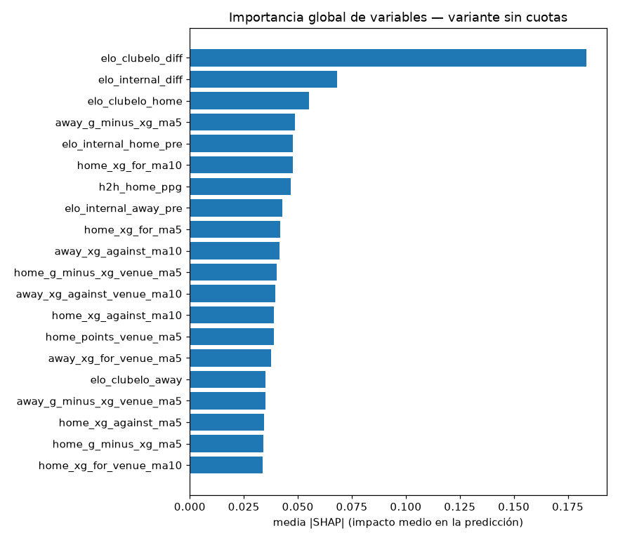
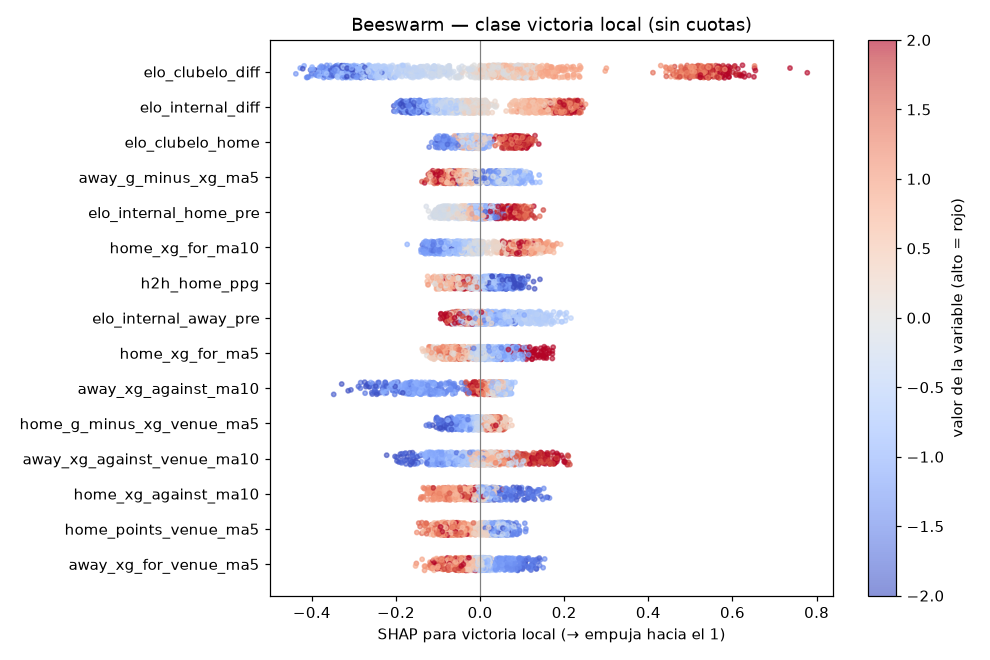
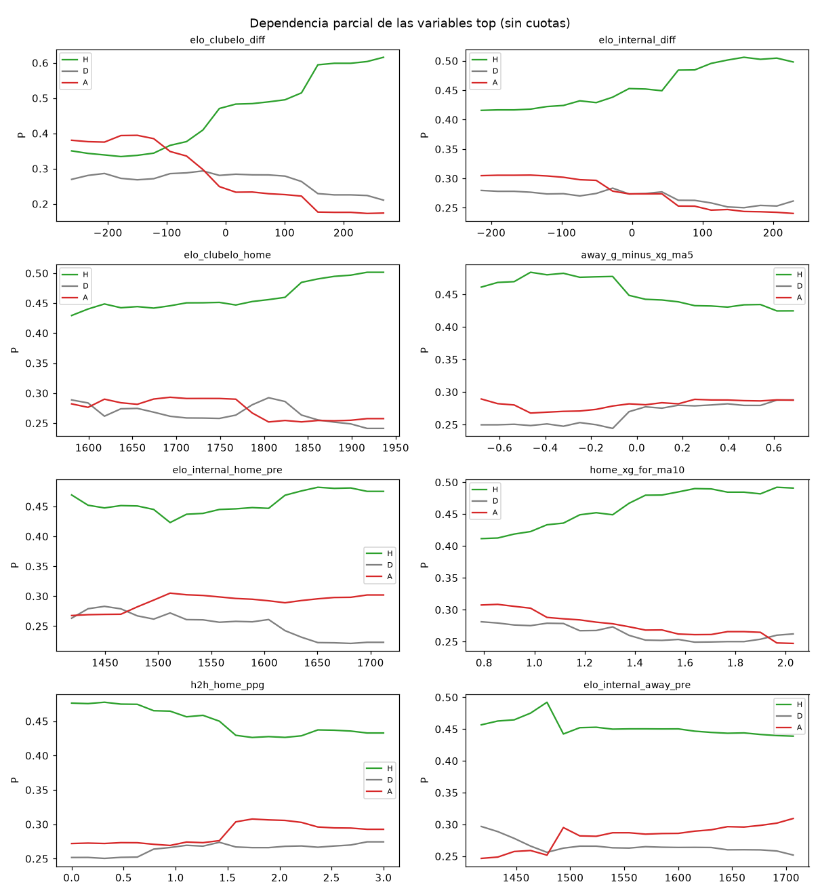

# Importancia de variables (F5)

Generado: 2026-07-15T16:40:08+00:00
Modelo: `v1-20260715-161137` — variante **sin cuotas** (la interpretable).

Todo el análisis se hace sobre la variante sin cuotas (SPEC §4.1): con
cuotas el mercado domina y tapa qué variables *futbolísticas* importan.

## 1. Importancia global (SHAP)

Media de |SHAP| por variable (impacto medio en la predicción, agregado
sobre las tres clases). Las 15 primeras:

| # | Variable | media \|SHAP\| |
|---|----------|--------------|
| 1 | `elo_clubelo_diff` | 0.1837 |
| 2 | `elo_internal_diff` | 0.0682 |
| 3 | `elo_clubelo_home` | 0.0552 |
| 4 | `away_g_minus_xg_ma5` | 0.0485 |
| 5 | `elo_internal_home_pre` | 0.0477 |
| 6 | `home_xg_for_ma10` | 0.0476 |
| 7 | `h2h_home_ppg` | 0.0468 |
| 8 | `elo_internal_away_pre` | 0.0430 |
| 9 | `home_xg_for_ma5` | 0.0420 |
| 10 | `away_xg_against_ma10` | 0.0416 |
| 11 | `home_g_minus_xg_venue_ma5` | 0.0403 |
| 12 | `away_xg_against_venue_ma10` | 0.0395 |
| 13 | `home_xg_against_ma10` | 0.0390 |
| 14 | `home_points_venue_ma5` | 0.0389 |
| 15 | `away_xg_for_venue_ma5` | 0.0377 |

## 2. Beeswarm — victoria local

Cada punto es un partido; la x es cuánto empuja esa variable hacia la
victoria local y el color, el valor de la variable (rojo = alto).

## 3. Dependencia parcial de las variables top

Efecto marginal: cómo cambia P(1X2) al barrer cada variable dejando el
resto fijo (H = victoria local, D = empate, A = victoria visitante).

## 4. Ablation study — aportación de cada bloque

Log-loss walk-forward quitando bloques enteros de features. Un bloque
aporta si quitarlo **empeora** el log-loss (delta > 0).

| Bloque | Variables quitadas | Log-loss | Δ vs completo |
|--------|--------------------|----------|---------------|
| (modelo completo) | 0 | 1.0227 | — |
| elo | 6 | 1.0369 | +0.0142 |
| contexto | 7 | 1.0338 | +0.0111 |
| forma | 16 | 1.0330 | +0.0103 |
| descanso | 2 | 1.0297 | +0.0070 |
| xg | 24 | 1.0234 | +0.0007 |

> Nota: el ablation usa el LightGBM sin cuotas (no el ensemble completo)
> para aislar la contribución de las features al clasificador. Deltas de
> pocas milésimas están dentro del ruido; lo relevante es el signo y el
> orden de magnitud relativo entre bloques.

## Apéndice — diccionario de variables

Qué significa cada columna del modelo (ordenadas por importancia SHAP;
guía general en `docs/diccionario-features.md`):

| Variable | Significado |
|----------|-------------|
| `elo_clubelo_diff` | Diferencia de Elo de ClubElo (local − visitante): ventaja de nivel |
| `elo_internal_diff` | Diferencia de Elo interno (local − visitante) |
| `elo_clubelo_home` | Elo de ClubElo del equipo LOCAL, el último publicado antes del partido |
| `away_g_minus_xg_ma5` | Media de goles − xG (sobre/infrarrendimiento; tiende a revertir) del VISITANTE en sus últimos 5 partidos (siempre anteriores al actual) |
| `elo_internal_home_pre` | Elo interno (ADR-013) del LOCAL justo antes del partido |
| `home_xg_for_ma10` | Media de xG generado (calidad de ocasiones creadas) del LOCAL en sus últimos 10 partidos (siempre anteriores al actual) |
| `h2h_home_ppg` | Puntos/partido del LOCAL en los últimos 5 enfrentamientos directos |
| `elo_internal_away_pre` | Elo interno (ADR-013) del VISITANTE justo antes del partido |
| `home_xg_for_ma5` | Media de xG generado (calidad de ocasiones creadas) del LOCAL en sus últimos 5 partidos (siempre anteriores al actual) |
| `away_xg_against_ma10` | Media de xG concedido (calidad de ocasiones del rival) del VISITANTE en sus últimos 10 partidos (siempre anteriores al actual) |
| `home_g_minus_xg_venue_ma5` | Media de goles − xG (sobre/infrarrendimiento; tiende a revertir) del LOCAL en sus últimos 5 partidos solo en su condición (casa) (siempre anteriores al actual) |
| `away_xg_against_venue_ma10` | Media de xG concedido (calidad de ocasiones del rival) del VISITANTE en sus últimos 10 partidos solo en su condición (fuera) (siempre anteriores al actual) |
| `home_xg_against_ma10` | Media de xG concedido (calidad de ocasiones del rival) del LOCAL en sus últimos 10 partidos (siempre anteriores al actual) |
| `home_points_venue_ma5` | Media de puntos por partido del LOCAL en sus últimos 5 partidos solo en su condición (casa) (siempre anteriores al actual) |
| `away_xg_for_venue_ma5` | Media de xG generado (calidad de ocasiones creadas) del VISITANTE en sus últimos 5 partidos solo en su condición (fuera) (siempre anteriores al actual) |
| `elo_clubelo_away` | Elo de ClubElo del VISITANTE, el último publicado antes del partido |
| `away_g_minus_xg_venue_ma5` | Media de goles − xG (sobre/infrarrendimiento; tiende a revertir) del VISITANTE en sus últimos 5 partidos solo en su condición (fuera) (siempre anteriores al actual) |
| `home_xg_against_ma5` | Media de xG concedido (calidad de ocasiones del rival) del LOCAL en sus últimos 5 partidos (siempre anteriores al actual) |
| `home_g_minus_xg_ma5` | Media de goles − xG (sobre/infrarrendimiento; tiende a revertir) del LOCAL en sus últimos 5 partidos (siempre anteriores al actual) |
| `home_xg_for_venue_ma10` | Media de xG generado (calidad de ocasiones creadas) del LOCAL en sus últimos 10 partidos solo en su condición (casa) (siempre anteriores al actual) |
| `away_points_venue_ma10` | Media de puntos por partido del VISITANTE en sus últimos 10 partidos solo en su condición (fuera) (siempre anteriores al actual) |
| `home_g_minus_xg_venue_ma10` | Media de goles − xG (sobre/infrarrendimiento; tiende a revertir) del LOCAL en sus últimos 10 partidos solo en su condición (casa) (siempre anteriores al actual) |
| `away_goals_against_venue_ma10` | Media de goles en contra del VISITANTE en sus últimos 10 partidos solo en su condición (fuera) (siempre anteriores al actual) |
| `home_g_minus_xg_ma10` | Media de goles − xG (sobre/infrarrendimiento; tiende a revertir) del LOCAL en sus últimos 10 partidos (siempre anteriores al actual) |
| `away_xg_against_venue_ma5` | Media de xG concedido (calidad de ocasiones del rival) del VISITANTE en sus últimos 5 partidos solo en su condición (fuera) (siempre anteriores al actual) |
| `home_xg_for_venue_ma5` | Media de xG generado (calidad de ocasiones creadas) del LOCAL en sus últimos 5 partidos solo en su condición (casa) (siempre anteriores al actual) |
| `home_goals_against_venue_ma10` | Media de goles en contra del LOCAL en sus últimos 10 partidos solo en su condición (casa) (siempre anteriores al actual) |
| `home_xg_against_venue_ma5` | Media de xG concedido (calidad de ocasiones del rival) del LOCAL en sus últimos 5 partidos solo en su condición (casa) (siempre anteriores al actual) |
| `home_xg_against_venue_ma10` | Media de xG concedido (calidad de ocasiones del rival) del LOCAL en sus últimos 10 partidos solo en su condición (casa) (siempre anteriores al actual) |
| `away_g_minus_xg_venue_ma10` | Media de goles − xG (sobre/infrarrendimiento; tiende a revertir) del VISITANTE en sus últimos 10 partidos solo en su condición (fuera) (siempre anteriores al actual) |
| `away_xg_for_ma5` | Media de xG generado (calidad de ocasiones creadas) del VISITANTE en sus últimos 5 partidos (siempre anteriores al actual) |
| `away_xg_against_ma5` | Media de xG concedido (calidad de ocasiones del rival) del VISITANTE en sus últimos 5 partidos (siempre anteriores al actual) |
| `matchday` | Jornada oficial (fase de la temporada) |
| `away_xg_for_venue_ma10` | Media de xG generado (calidad de ocasiones creadas) del VISITANTE en sus últimos 10 partidos solo en su condición (fuera) (siempre anteriores al actual) |
| `away_xg_for_ma10` | Media de xG generado (calidad de ocasiones creadas) del VISITANTE en sus últimos 10 partidos (siempre anteriores al actual) |
| `home_goals_against_ma10` | Media de goles en contra del LOCAL en sus últimos 10 partidos (siempre anteriores al actual) |
| `away_g_minus_xg_ma10` | Media de goles − xG (sobre/infrarrendimiento; tiende a revertir) del VISITANTE en sus últimos 10 partidos (siempre anteriores al actual) |
| `home_points_ma10` | Media de puntos por partido del LOCAL en sus últimos 10 partidos (siempre anteriores al actual) |
| `away_goals_against_ma10` | Media de goles en contra del VISITANTE en sus últimos 10 partidos (siempre anteriores al actual) |
| `away_points_ma5` | Media de puntos por partido del VISITANTE en sus últimos 5 partidos (siempre anteriores al actual) |
| `away_goals_for_ma5` | Media de goles a favor del VISITANTE en sus últimos 5 partidos (siempre anteriores al actual) |
| `home_goals_against_venue_ma5` | Media de goles en contra del LOCAL en sus últimos 5 partidos solo en su condición (casa) (siempre anteriores al actual) |
| `home_rest_days` | Días de descanso del LOCAL desde su partido anterior de liga |
| `away_goals_against_ma5` | Media de goles en contra del VISITANTE en sus últimos 5 partidos (siempre anteriores al actual) |
| `away_goals_against_venue_ma5` | Media de goles en contra del VISITANTE en sus últimos 5 partidos solo en su condición (fuera) (siempre anteriores al actual) |
| `home_goals_for_venue_ma5` | Media de goles a favor del LOCAL en sus últimos 5 partidos solo en su condición (casa) (siempre anteriores al actual) |
| `home_points_venue_ma10` | Media de puntos por partido del LOCAL en sus últimos 10 partidos solo en su condición (casa) (siempre anteriores al actual) |
| `away_rest_days` | Días de descanso del VISITANTE desde su partido anterior de liga |
| `home_win_streak` | Victorias consecutivas del LOCAL antes del partido |
| `home_goals_against_ma5` | Media de goles en contra del LOCAL en sus últimos 5 partidos (siempre anteriores al actual) |
| `home_goals_for_venue_ma10` | Media de goles a favor del LOCAL en sus últimos 10 partidos solo en su condición (casa) (siempre anteriores al actual) |
| `home_points_ma5` | Media de puntos por partido del LOCAL en sus últimos 5 partidos (siempre anteriores al actual) |
| `away_points_venue_ma5` | Media de puntos por partido del VISITANTE en sus últimos 5 partidos solo en su condición (fuera) (siempre anteriores al actual) |
| `home_goals_for_ma10` | Media de goles a favor del LOCAL en sus últimos 10 partidos (siempre anteriores al actual) |
| `away_goals_for_venue_ma10` | Media de goles a favor del VISITANTE en sus últimos 10 partidos solo en su condición (fuera) (siempre anteriores al actual) |
| `home_goals_for_ma5` | Media de goles a favor del LOCAL en sus últimos 5 partidos (siempre anteriores al actual) |
| `promoted_away` | 1 si el VISITANTE es recién ascendido |
| `away_points_ma10` | Media de puntos por partido del VISITANTE en sus últimos 10 partidos (siempre anteriores al actual) |
| `month` | Mes del partido (estacionalidad) |
| `home_loss_streak` | Derrotas consecutivas del LOCAL antes del partido |
| `away_goals_for_ma10` | Media de goles a favor del VISITANTE en sus últimos 10 partidos (siempre anteriores al actual) |
| `away_goals_for_venue_ma5` | Media de goles a favor del VISITANTE en sus últimos 5 partidos solo en su condición (fuera) (siempre anteriores al actual) |
| `away_win_streak` | Victorias consecutivas del VISITANTE antes del partido |
| `promoted_home` | 1 si el LOCAL es recién ascendido (no jugó la temporada anterior) |
| `away_loss_streak` | Derrotas consecutivas del VISITANTE antes del partido |
| `no_crowd` | 1 si la temporada se jugó sin público (COVID, config) |
| `derby` | 1 si el cruce es un derbi (pares definidos en config) |

